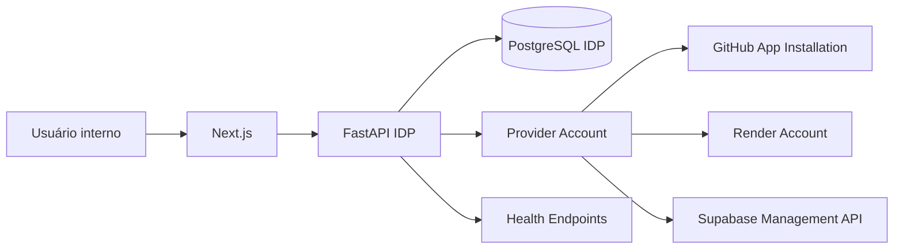

# Arquitetura

## Visão geral



## Fluxo obrigatório

```text
Frontend
-> backend do IDP
-> atribui o papel administrativo de acesso direto
-> carrega ProductResource
-> valida product_id + provider_account_id + resource_id + environment
-> resolve credential_ref no ambiente
-> chama provedor externo com timeout
-> sanitiza payload
-> grava snapshot
-> retorna somente dados operacionais
```

## Fronteiras

O IDP é um quarto sistema. Ele não é módulo de MILU, ColorGlass ou Super Excel. Possui:

- banco exclusivo;
- acesso direto sem provedor de autenticação;
- frontend e backend próprios;
- credenciais próprias para consultar cada conta externa;
- deploy independente.

## Modelo de isolamento

`provider_accounts` pertence obrigatoriamente a um `product_id`. `product_resources` pertence simultaneamente ao produto e, quando externo, a uma conta específica.

Antes de qualquer chamada operacional, o backend valida:

1. a conta existe;
2. a conta pertence ao produto;
3. o recurso pertence ao produto;
4. o recurso pertence à conta;
5. o ambiente corresponde ao solicitado.

## Snapshots

A tela nunca dispara consultas em massa nas APIs externas. O scheduler e as sincronizações manuais atualizam:

- `resource_snapshots`;
- `health_check_results`;
- `sync_runs`;
- `provider_accounts.last_sync_at`.

Isso reduz rate limits, melhora latência e permite diferenciar dado desatualizado de indisponibilidade atual.

## Estado geral

O estado do produto considera:

- conexão GitHub, Render e Supabase;
- pior health check;
- último deploy Render;
- último workflow GitHub;
- existência de snapshots.

Falhas de autenticação dos provedores externos são tratadas separadamente do estado do IDP.

## Concorrência

O MVP usa locks em memória para impedir sincronização duplicada do mesmo recurso ou conta. APScheduler usa `max_instances=1` e `coalesce=true`.

Em escala horizontal, substituir por advisory locks PostgreSQL ou fila distribuída.
